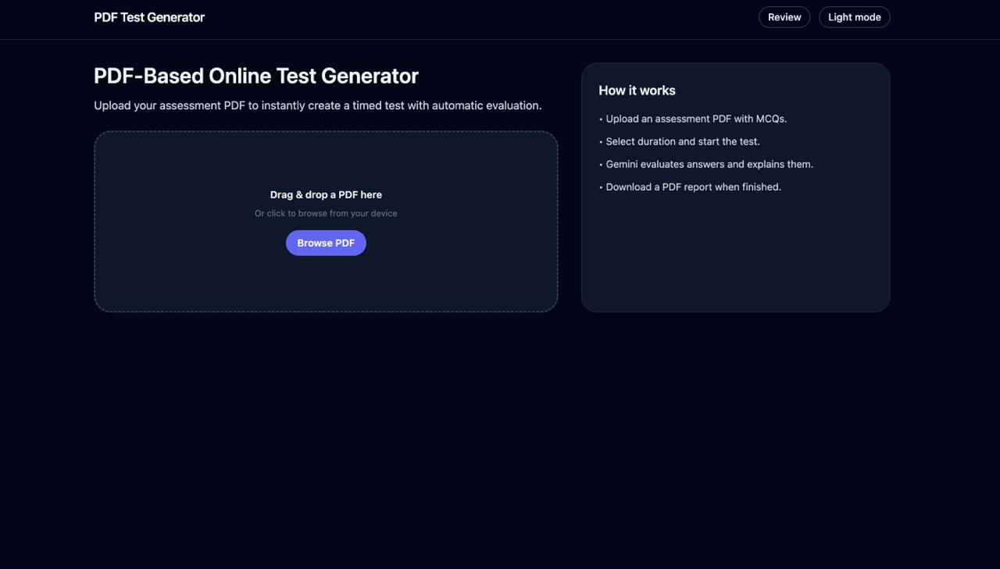
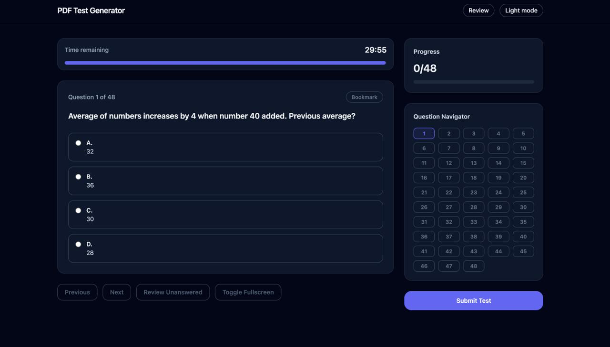
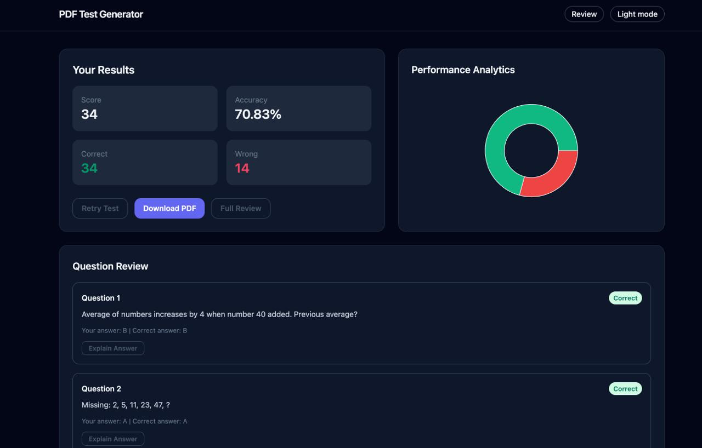
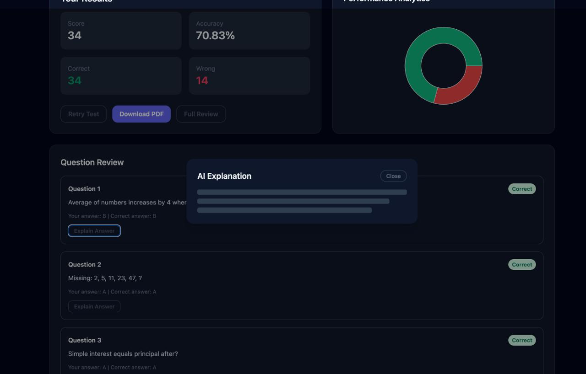
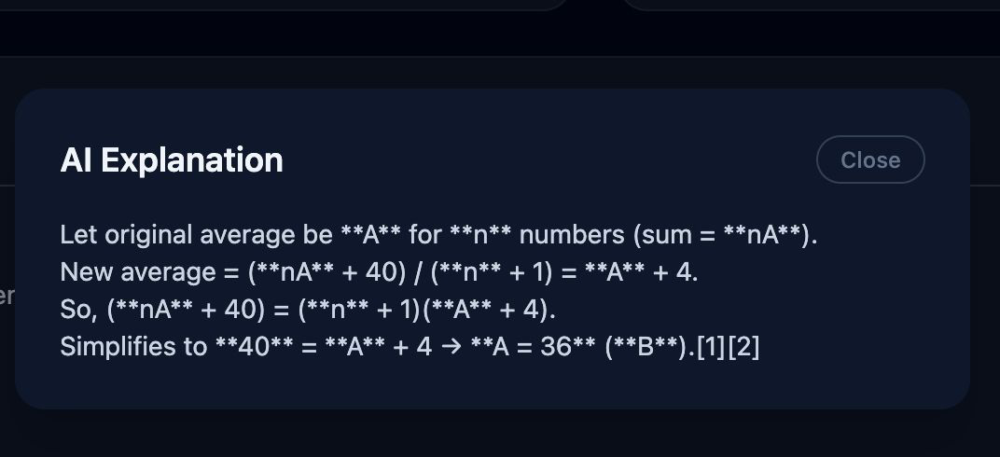

# AI-Powered Test Generator & Evaluator

A full-stack web application that generates timed online tests from PDFs or company-based assessments using AI, evaluates answers using Gemini, and generates detailed results with explanations.

## Features

### PDF Mode
- Drag & drop PDF upload with automatic question extraction
- Questions maintain original PDF order
- Support for multiple choice questions

### Company Assessment Mode (NEW)
- AI-powered test generation based on company hiring patterns
- Deep research using Perplexity API
- Realistic assessments matching real campus OA patterns
- Automatic caching of company profiles
- 50 questions across: Aptitude, Core CS, DSA, and Coding

### Test Experience
- Timed test environment with fullscreen mode
- Question bookmarks and unanswered review
- Auto-submit on timer expiry
- Gemini-powered evaluation and explanations
- Results dashboard with analytics chart
- Retry test mode and downloadable PDF report
- Persistent state via localStorage to avoid refresh loss

## Tech Stack

**Frontend**: React (Vite), TypeScript, TailwindCSS, Recharts, jsPDF

**Backend**: FastAPI, SQLite, pdfplumber, Google Gemini API

## Project Structure

```
pdf-test-generator/
├── backend/
│   ├── main.py                    # FastAPI application
│   ├── company_research.py        # Perplexity API integration
│   ├── company_cache.py           # Company profile caching
│   ├── llm_test_generator.py      # AI test generation
│   ├── company_routes.py          # Company assessment endpoints
│   ├── pdf_parser.py              # PDF extraction
│   ├── test_generator.py          # Test session management
│   └── evaluator.py               # Answer evaluation
├── frontend/
│   └── src/
│       ├── pages/
│       │   └── Upload.tsx         # Dual-mode upload page
│       └── api/
├── data/
│   └── company_profiles/          # Cached company profiles
└── README.md
```

## Environment Setup

### Backend

1. Create a virtual environment and install dependencies.
2. Copy `.env.example` to `.env` and set your API key.

Example `.env`:
```
GEMINI_API_KEY=YOUR_GEMINI_KEY
PERPLEXITY_API_KEY=YOUR_PERPLEXITY_KEY
DATABASE_URL=sqlite:///./app.db
CORS_ORIGINS=http://localhost:5173
```

3. Run the backend server:
```
cd backend
pip install -r requirements.txt
uvicorn main:app --reload
```

### Frontend

1. Install dependencies and start the dev server:
```
cd frontend
npm install
npm run dev
```

2. If needed, set `VITE_API_BASE_URL` in a `.env` file inside the frontend directory.

## API Keys Setup

### Get Perplexity API Key (for Company Assessment)
1. Visit [Perplexity API](https://www.perplexity.ai/settings/api)
2. Generate an API key
3. Add to backend `.env`: `PERPLEXITY_API_KEY=your_key`

**Note:** Perplexity API is used for both company research and test generation.

### Get Gemini API Key (Optional - for PDF mode)
1. Visit [Google AI Studio](https://makersuite.google.com/app/apikey)
2. Create a new API key
3. Add to backend `.env`: `GEMINI_API_KEY=your_key`

**Note:** Gemini is used for PDF extraction and answer evaluation. Company mode works with only Perplexity.

## How to Use

### PDF Mode
1. Click "Upload PDF" and select a PDF containing MCQs.
2. Choose test duration and start.
3. Answer questions, bookmark, and review.
4. Submit or auto-submit on timer end.
5. View results, explanations, and analytics.

<<<<<<< HEAD

=======
### Company Assessment Mode
1. Click "Generate by Company" tab.
2. Enter company name (e.g., Google, Amazon, Microsoft).
3. AI researches the company's hiring pattern (cached for future use).
4. Generates realistic 50-question assessment.
5. Take the test and get AI-powered evaluation.

## AI Integration

### Perplexity API
- **Model**: sonar-pro
- **Company Research**: Research company hiring patterns, assessment structure, difficulty levels
- **Test Generation**: Creates 50 realistic questions across Aptitude, Core CS, DSA, and Coding sections
- **Caching**: Company profiles cached in `data/company_profiles/` to avoid redundant API calls

### Gemini API (Answer Evaluation Only)
- **Answer Evaluation Prompt**: Returns JSON with correct option, correctness, and short explanation
- **Explanation Prompt**: Explains the correct answer in simple terms (max 4 lines)

### Key Prompting Strategies
- Avoids textbook-style questions
- Generates modern interview-style problems
- Matches real campus OA patterns
- Varies difficulty based on company profile

## Deployment (Free Tier)

### Frontend (Vercel)

1. Set the Vercel project root to `frontend`.
2. Add environment variable `VITE_API_BASE_URL` pointing to your backend URL.
3. Deploy.

### Backend (Render / Railway)

1. Set the service root to `backend`.
2. Add environment variables:
   - `GEMINI_API_KEY`
   - `PERPLEXITY_API_KEY` (for company assessment feature)
3. Use the start command:
```
uvicorn main:app --host 0.0.0.0 --port 8000
```
>>>>>>> 8ae858b (company function added)

**Note**: Company assessment feature requires both API keys. PDF mode only needs Gemini.

## Screenshots

### Upload Page - Dual Mode Interface


### Company Assessment Generation


### Test Environment


### Results Dashboard


### AI-Powered Explanations


### Review Page


---

## 📚 Additional Documentation

- **[QUICKSTART.md](QUICKSTART.md)** - Get started in 5 minutes
- **[API_DOCUMENTATION.md](API_DOCUMENTATION.md)** - Complete API reference
- **[IMPLEMENTATION_GUIDE.md](IMPLEMENTATION_GUIDE.md)** - Architecture & technical details
- **[FEATURE_COMPARISON.md](FEATURE_COMPARISON.md)** - PDF vs Company mode comparison
- **[IMPLEMENTATION_SUMMARY.md](IMPLEMENTATION_SUMMARY.md)** - What was built

---

## 🎯 Key Features

### ✨ New: Company Assessment Mode
- Generate realistic assessments based on company hiring patterns
- AI-powered research using Perplexity API
- Automatic profile caching for faster subsequent tests
- 50 questions across 4 sections matching real campus OAs

### 📄 Classic: PDF Mode
- Upload and extract questions from PDFs
- Maintains original question order
- Supports multiple choice questions
- Fallback AI extraction for complex formats

### 🚀 Both Modes Share
- Timed test environment with fullscreen
- Question bookmarks and review
- AI-powered evaluation and explanations
- Results dashboard with analytics
- Retry tests with new questions
- Downloadable PDF reports

---

## 🏆 Success Metrics

- **0** breaking changes to existing code
- **4** new backend modules
- **3** comprehensive documentation files
- **50** questions generated per company test
- **~5-8s** generation time (cached)
- **100%** backward compatibility

---

**Built with ❤️ using FastAPI, React, Gemini AI, and Perplexity AI**
